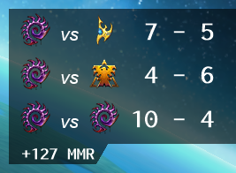

Keep track of your basic game stats. Your win/loss record, win percentage, and MMR gain/loss for each gaming session.

This tool creates 5 text files in your current working directory:
* ZvP.txt
* ZvT.txt
* ZvZ.txt
* MMR-diff.txt
* winrate.txt

## useAPI

When a game finishes it saves your MMR to the replay file (the start of game MMR).

There's a setting called `useAPI`. It's optional, but it makes your MMR-diff more accurate by 1 game (~ 20 MMR). If set to false, I get your MMR data from the replay. This isn't good because you must play 2 games before it starts showing a ± MMR. Also, on your last game I don't know your live MMR as that is recorded at the end of the next game.

If set to true, then it's perfectly accurate. Your start MMR is set immediately, and as your last game finishes I also get your live MMR number.

## Usage

Place the .exe in any folder and run it. It will instantly close creating a template settings file (cfg.toml). Modify these 3 lines in `cfg.toml` and you're done. Rerun the program:
- name = 
- mainToon =
- dir = 

1. Find your starcraft2.com profile URL. [^1]
    - set name
    - set race
1. List all accounts you have for `name =`. [^2]
1. Set `mainToon =`.
1. Set `dir =`. Use forward slash or double backslash for where your replays are saved.
1. Set `useAPI =` to true if you want the most accurate MMR difference.

```sh
#     name - Put a comma-separated list of your SC2 accounts like in the example (url, name, race).
# mainToon - You must choose only one name to use.
#      dir - Where to watch for new SC2 replays (use either a single slash, or a double backslash).

[account]
name = [ [ "https://starcraft2.com/en-gb/profile/1/1/1331332", "Gixxasaurus", "zerg" ] ]

# name = [ [ "https://starcraft2.com/en-gb/profile/1/1/1331332", "Gixxasaurus", "zerg" ],
#          [ "https://starcraft2.com/en-gb/profile/2/1/4545534", "Rairden", "zerg" ],
#          [ "https://starcraft2.com/en-gb/profile/1/1/6901550", "PREAHLANY", "zerg"] ]

mainToon = "Gixxasaurus"

[directory]
dir = "/home/erik/scratch/replays/"
# dir = "C:/Users/Erik/Downloads/reps/"
# dir = "C:\\Users\\Erik\\Downloads\\reps\\"

[settings]
updateTime = 1000
useAPI = false
OAuth2Creds = "http://108.61.119.116"
```


After you play SC2 or put a replay in your watch folder, the app will generate 5 .txt files you can use as overlays in something like OBS for streaming.

[^1]: Since each account can have multiple names and races I need those values.
[^2]: If you only have one account URL, then use the first one. Lines starting w/ hashtag (#) are ignored.
